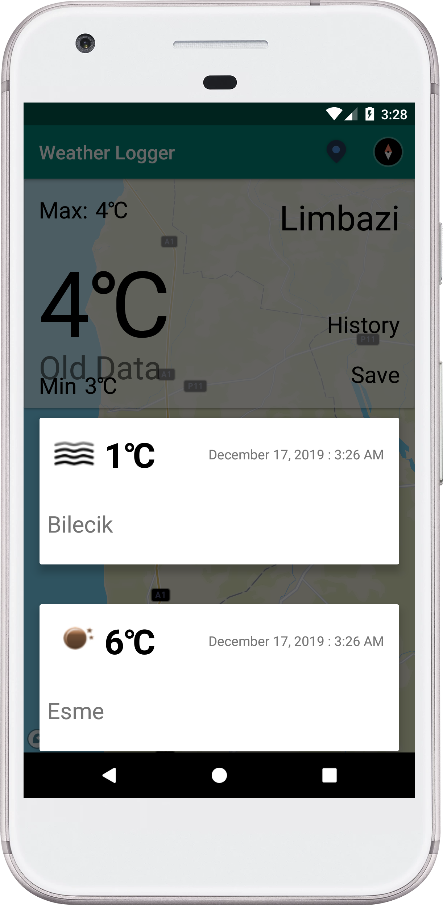
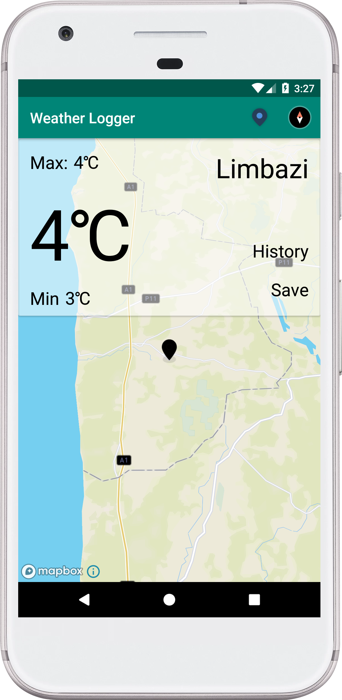

# Weather-Logger
Accenture Latvia Development Task

## Used Language

- Kotlin

  

## Used Architecture

- MVVM

## Used Libraries

- Room for Database

- ## Retrofit2 for Restful

- Kotlin Coroutines for Thread Management

- Mapbox for Location and Maps

- Google Fused Location for Location

- Android Architecture NavigationUI for fragment navigation

## Completed Optional Requirements:

- Implement ‘More details’ screen (with ability to view more detailed information
  about weather data returned from API)

  *Added Map and show max and min temps*

- Fetching and processing weather data for more locations

  *Users can choose location via map with animation.*

- Refresh the weather data periodically

  *I did not fetch data periodically, but fetching when user click the button.*

- Custom animations, transitions between screens

  *Used Mapbox animations on maps.*

- Use Kotlin instead of Java for MainActivity

  *The project completely developed with Kotlin*

